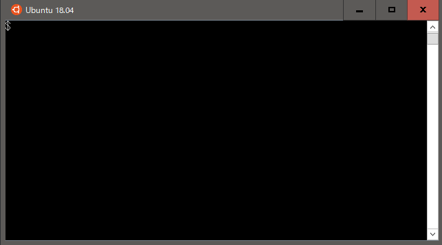
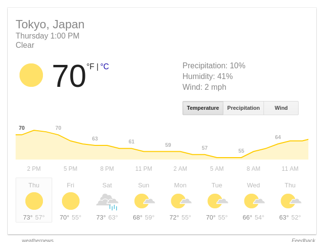

# WebScraper for GAE

Scrape with Google App Engine Standard for web page.



## Description

You can scrape a web page by specifying a URL and a selector.

* CSS selector available for selector
* It can be acquired either as a character string or as an image.

It can be used sufficiently within the range in which costs do not occur!!

## Usage

### Fetch strings

```sh
curl -H 'Content-Type:application/json' -d '{"url": "http://example.com/", "selector": "h1"}' https://web-scraper-gae-xxx.appspot.com/

```

output

```sh
["Example Domain"]
```

### Fetch image

```sh
curl -H 'Content-Type:application/json' -d '{"url": "https://www.google.co.jp/search?q=天気+東京", "selector": "#wob_wc", "imageNumber": 0, "lang": ["en, ja"]}'  --output weather.png https://web-scraper-gae.appspot-xxx.com/
```

output



## Setup & Deploy

### Create project for GAE

```sh
gcloud projects create web-scraper-gae-xxx --name WebScraper
gcloud app create --region asia-northeast1 --project web-scraper-gae-xxx
```

### Enable to Cloud Build API

Access to https://console.cloud.google.com/apis/library/cloudbuild.googleapis.com.

### Deploy

```sh
gcloud app deploy --project web-scraper-gae-xxx -q
```

### License

MIT

### Author

nobuhito.sato@gamil.com